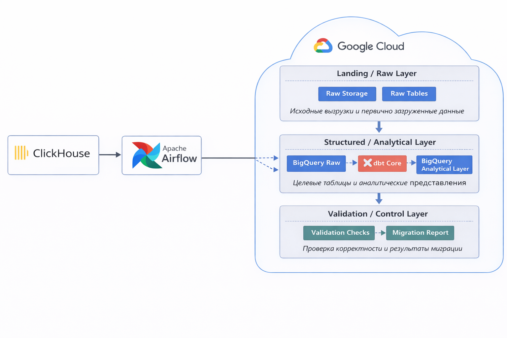
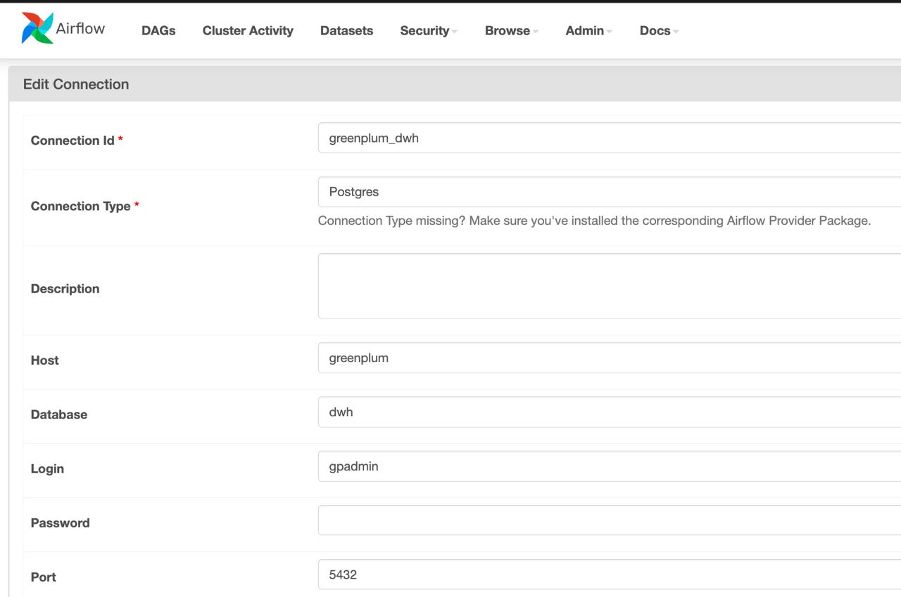
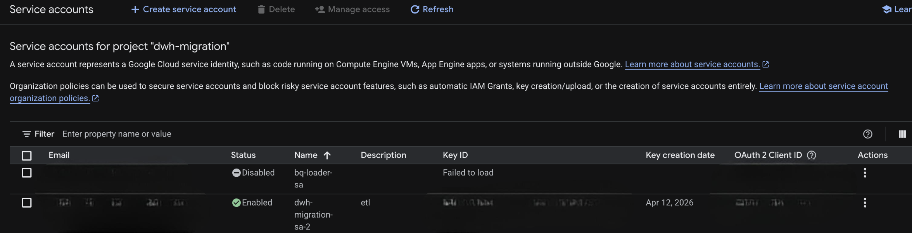

# Automated Data Warehouse Migration System

<p align="center">
  
  
  
  
  
  
</p>

## Description

This project is an automated system for migrating an on-premise analytical warehouse to Google Cloud.

The source system is **Greenplum** and the target platform is **BigQuery**. The idea is not just to move tables, but to build a controlled migration process with orchestration, cloud loading, analytical layer creation and validation.

---

## Architecture and Technologies

General flow:

**Greenplum → Apache Airflow → Google Cloud**

<p align="center">
  
</p>


* **Greenplum** — source analytical warehouse
* **Apache Airflow** — workflow orchestration
* **Google Cloud Storage** — intermediate cloud storage
* **BigQuery** — target analytical platform
* **dbt Core** — analytical layer modeling
* **Python** — migration service logic
* **PostgreSQL** — Airflow metadata database

Ports:

* **Airflow Webserver**: `8080`
* **Greenplum**: `5432`

---

## Project Structure

```text
migration-service/
├── README.md
├── docker-compose.yml
├── .env.example
├── airflow/
│   └── dags/
        ├── full_source_build_pipeline.py
│       ├── hr_pipeline.py
│       ├── risk_pipeline.py
│       ├── access_pipeline.py
│       └── finance_pipeline.py
├── infra/
│   ├── airflow/
│   │   ├── Dockerfile
│   │   └── requirements.txt
│   └── greenplum/
│       └── init/
│           ├── risk/
│           │   ├── 001_raw_tables.sql
│           │   ├── 002_dds_tables.sql
│           │   ├── 003_dm_objects.sql
│           │   ├── 004_load_raw.sql
│           │   ├── 005_build_dds.sql
│           │   ├── 006_build_dm.sql
│           │   ├── metadata.yaml
│           │   └── dependencies.yaml
│           ├── hr/
│           │   ├── 001_raw_tables.sql
│           │   ├── 002_dds_tables.sql
│           │   ├── 003_dm_objects.sql
│           │   ├── 004_load_raw.sql
│           │   ├── 005_build_dds.sql
│           │   ├── 006_build_dm.sql
│           │   ├── metadata.yaml
│           │   └── dependencies.yaml
│           ├── access/
│           │   ├── 001_raw_tables.sql
│           │   ├── 002_dds_tables.sql
│           │   ├── 003_dm_objects.sql
│           │   ├── 004_load_raw.sql
│           │   ├── 005_build_dds.sql
│           │   ├── 006_build_dm.sql
│           │   ├── metadata.yaml
│           │   └── dependencies.yaml
│           └── finance/
│               ├── 001_raw_tables.sql
│               ├── 002_dds_tables.sql
│               ├── 003_dm_objects.sql
│               ├── 004_load_raw.sql
│               ├── 005_build_dds.sql
│               ├── 006_build_dm.sql
│               ├── metadata.yaml
│               └── dependencies.yaml
├── scripts/
│   ├── init_greenplum_base.sh
│   ├── run_greenplum_sql.sh
│   ├── run_greenplum_query.sh
│   └── data_gen/
│       ├── generate_risk_raw_data.py
│       ├── generate_hr_raw_data.py
│       ├── generate_access_raw_data.py
│       ├── generate_finance_raw_data.py
│       └── output/
└── docs/
    ├── airflow_connection.png
    └── readme/
        ├──data-flow-scheme.png
```

* **airflow/dags/** — Airflow DAGs
* **infra/airflow/** — Airflow image and dependencies
* **infra/greenplum/init/** — Greenplum initialization scripts
* **src/migration_service/** — main migration code
* **dbt/** — target analytical models
* **metadata/** — extracted schemas and artifacts
* **config/** — migration configuration
* **scripts/** — helper scripts

---

## Quick Start

### 1. Clone repository

```bash
git clone <repository-url>
cd data-migration-system
```

### 2. Create `.env` like .env.example


### 3. Start containers

```bash
docker compose up -d --build
```

### 4. Create Airflow Connection

Open `http://localhost:8080`

Login:

* **username**: `admin`
* **password**: `admin`

In Airflow UI go to:

**Admin → Connections → Add Connection**

Use these values:

* **Connection Id**: `greenplum_dwh`
* **Connection Type**: `Postgres`
* **Host**: `greenplum`
* **Schema**: `dwh`
* **Login**: `gpadmin`
* **Password**: `gpadmin`
* **Port**: `5432`
  
<p align="center">
  
</p>

### 5. Google Cloud Setup

* Create `service account`
* Create a JSON key for the service account and save it to: **secrets/gcp/service-account.json**

<p align="center">
  
</p>

* Grant IAM roles: storage.objectAdmin, bigquery.dataEditor, bigquery.jobUser
* Create a Cloud Storage bucket
* Create BigQuery datasets - use the same region for all datasets