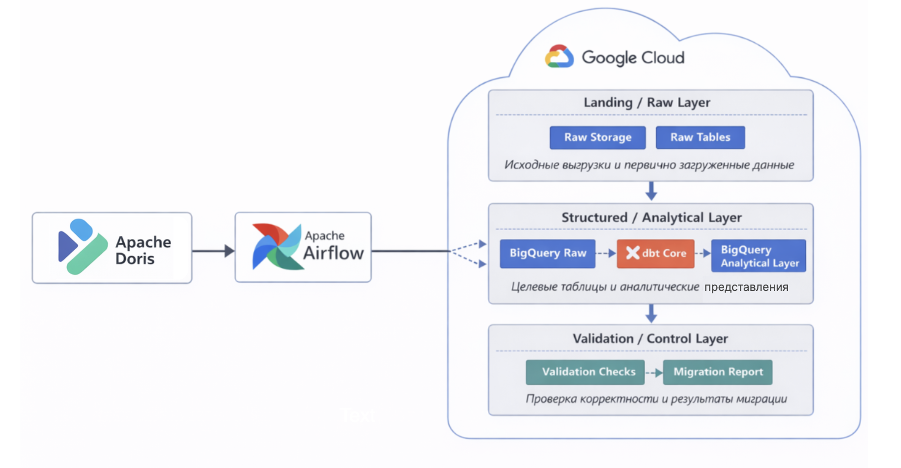

# Automated Data Warehouse Migration System

## Описание

Данный проект - автоматизированная система миграции on-premise аналитического хранилища в облачную платформу Google Cloud.

В качестве исходной системы используется Apache Doris, а целевой средой выступает BigQuery. Процесс миграции включает не только перенос данных, но и сохранение структуры хранилища с зависимостями, а также проверку корректности результата.

Ключевая идея - представить миграцию как управляемый процесс, включающий оркестрацию, перенос данных, построение аналитического слоя и валидацию.

---

## Архитектура решения

Общая логика системы:

Apache Doris → Apache Airflow → Google Cloud



В облачной среде данные последовательно проходят:

* слой первичной загрузки (raw);
* слой аналитической обработки;
* слой проверки и контроля.

---

## Используемые технологии

* Apache Doris — исходное аналитическое хранилище
* Apache Airflow — оркестрация процессов миграции
* Google Cloud Storage — промежуточное хранилище данных
* BigQuery — целевая аналитическая платформа
* dbt Core — построение аналитического слоя
* Python — реализация сервисной логики

---

## Структура проекта

```
data-migration-system/
├── README.md
├── docker-compose.yml
├── .env.example
├── config/
│   ├── domains.yaml
│   └── migration.yaml
├── infra/
│   ├── airflow/
│   │   ├── Dockerfile
│   │   └── requirements.txt
│   └── doris/
│       └── init/
├── src/
│   └── migration_service/
│       ├── connectors/
│       ├── extraction/
│       ├── loading/
│       ├── metadata/
│       └── validation/
├── airflow/
│   └── dags/
├── dbt/
│   ├── dbt_project.yml
│   └── models/
├── metadata/
└── scripts/
```

* **config/** — конфигурации доменов, таблиц и параметров миграции
* **infra/** — Docker-окружение и инициализация систем
* **src/migration_service/** — основной код сервиса миграции
* **airflow/dags/** — DAG-файлы оркестрации
* **dbt/** — модели аналитического слоя
* **metadata/** — извлечённые схемы и артефакты миграции
* **scripts/** — вспомогательные утилиты

---

## Основные этапы миграции

1. Извлечение данных и метаданных из Apache Doris
2. Загрузка данных в Google Cloud Storage
3. Перенос данных в BigQuery (raw слой)
4. Построение аналитического слоя
5. Проверка корректности миграции
